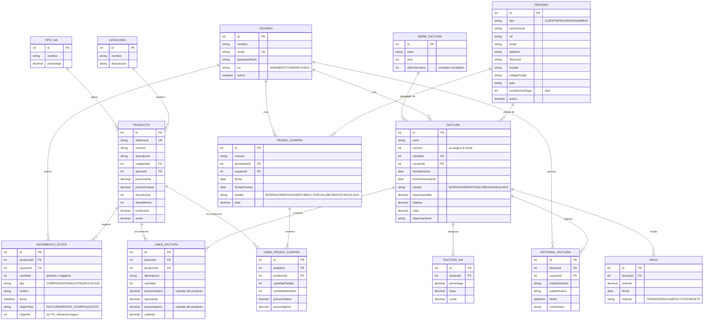

# Diagrama entidad-relación del ERP

Las tablas llevan además `createdAt` y `updatedAt`, que no se dibujan para no saturar el diagrama.

## Notas de lectura

- **MOVIMIENTO_STOCK** es la fuente de verdad del stock. `PRODUCTO.stockActual` es una copia que se actualiza en la misma transacción.
- **MOVIMIENTO_STOCK.origenTipo y origenId** apuntan a la factura o al pedido que generó el movimiento, pero sin clave foránea, porque el origen puede ser de tablas distintas.
- **FACTURA.serie y numero** se corresponden con una fila de SERIE_FACTURA (serie y año). El número se asigna solo al emitir y tiene restricción única junto con la serie.
- **LINEA_FACTURA** copia precio e IVA del producto en el momento de la venta, para que los cambios posteriores del catálogo no alteren facturas antiguas.
- **TERCERO** unifica clientes y proveedores: una misma empresa puede ser ambas cosas.
